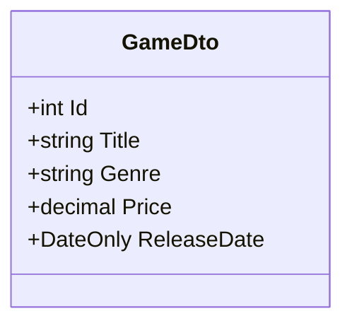
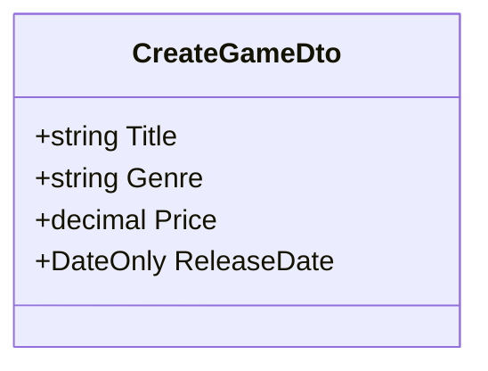
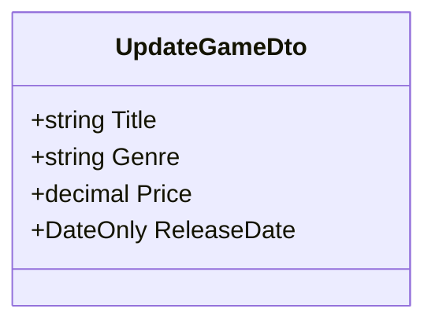

# Game Library API
The interface for manipulating the game library, with access to standard CRUD operations for creating, reading, updating and deleting data within the database.

## Resources
The <b>DTOs</b>* are declared as records, which are used for managing resource state; I opted to implement them as records to take advantange of their immutability, which allows for code reduction by having to incorporate boilerplate code to achieve the same functionality and by creating separate GameDtos for Create and Update - this allows for scalability in the event that the functionality changes.

**This refers to an object which carries data between processes or applications; this encapsulates data in a standardised format for transfer across layers or applications.*

## Endpoints
You can interact using CRUD operations and the server will respond with a status code and generally a JSON response body containing the resource state.

Using the listed endpoints, you are able to create, read, update and delete resources.

| Method & Operation | URI             | Description                         | Status         |
|--------------------|-----------------|-------------------------------------|----------------|
| `GET` Read         | /api/games      | Retrieve all games                  | 200 Success    |
| `GET` Read         | /api/games/{id} | Retrieve specific game by ID        | 200 Success    |
| `POST` Create      | /api/games      | Create new game                     | 201 Created    |
| `PUT` Update       | /api/games/{id} | Update existing game by ID or Title | 204 No Content |
| `DELETE` Delete    | /api/games/{id} | Delete specific game by ID or Title | 204 No Content |

In the event of an error, application will return a response body with the status and reason. Statuses are grouped and any error codes will appear in the ranges of *400-499* and *500-599* for client-side and server-side errors, respectively.
